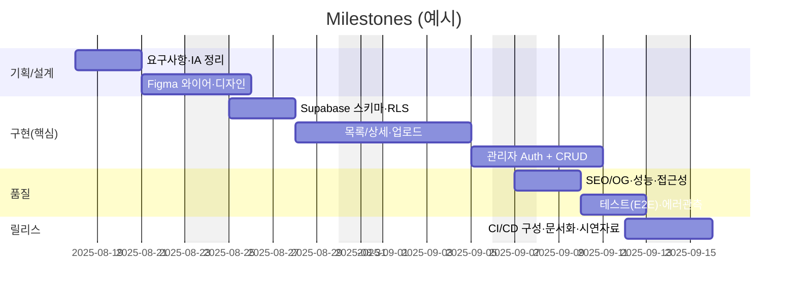
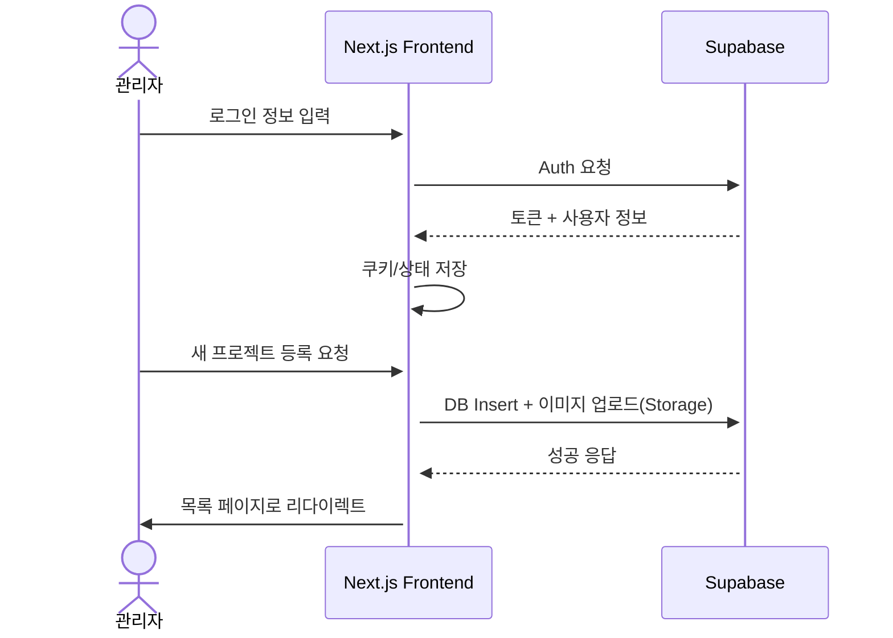
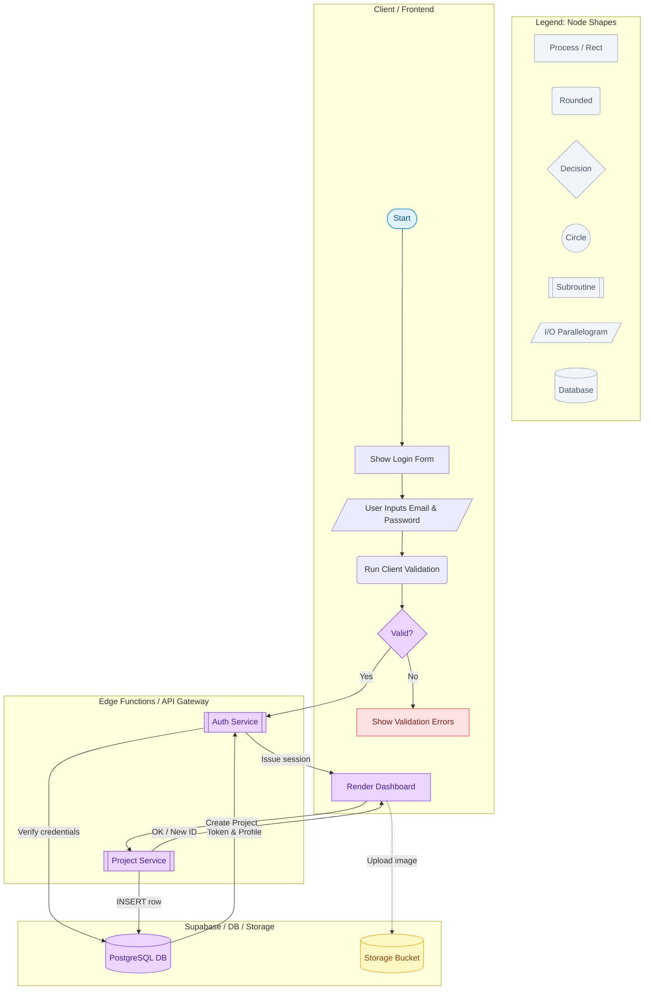
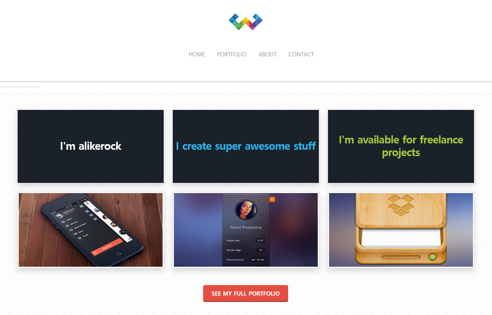

# Minimal Portfolio(3차 프로젝트)
- 과정명: 프로젝트기반 프론트엔드 개발자 양성
- 기간: 2025/03/24 ~ 2025/09/24
- 3차 프로젝트: 2025/08/27 ~ 2025/09/19

## 🔗 빠른 링크
- 📑 기획서(피그마 슬라이드): https://www.figma.com/file/XXXX
- 🎨 디자인 원본(피그마): https://www.figma.com/file/YYYY

## 1. 프로젝트 개요

### 1.1 목표

- **개인 작업물 전시**: 프론트엔드 과정 수료 후 제작한 프로젝트와 포트폴리오를 한 곳에 모아 소개
- **실서비스형 구현**: Next.js App Router와 Supabase를 활용한 인증, 데이터 관리, 파일 업로드 기능 포함
- **관리 효율성**: 관리자 로그인 후 포트폴리오 항목 CRUD가 가능하도록 구성
- **배포 경험**: Vercel을 통한 프로덕션 배포 및 CI/CD 경험

### 1.2 👥 팀원

| 이름 | 역할 | 주요 담당 | GitHub | 연락 |
| --- | --- | --- | --- | --- |
| 김동주 | 팀장 · FE 리드 | 아키텍처/폴더링<br>CI/CD(Vercel·Actions)<br>Supabase 스키마·RLS 정책<br>성능 최적화·코드리뷰 | [@alikerock](https://github.com/alikerock) | (예) dj.kim@example.com |
| 이가람 | FE · 제품기능 | 포트폴리오 목록/상세<br>검색·필터·페이지네이션<br>React Query/SWR 상태관리<br>접근성 개선(a11y) | [@garam-dev](https://github.com/garam-dev) | garam@example.com |
| 박지우 | FE · UI/디자인 | Figma 디자인 시스템<br>반응형 레이아웃·컴포넌트<br>이미지 업로드/최적화<br>OG/SEO 메타 | [@jiwoo-park](https://github.com/jiwoo-park) | jiwoo@example.com |

### 1.3 🗓️ 마일스톤

#### 1주차 — 기획/설계
- [ ] 요구사항·화면흐름 정의(Figma 슬라이드)
- [ ] 데이터 모델/테이블·RLS 설계
- [ ] 기본 라우팅/레이아웃/테마 결정

#### 2주차 — 핵심 기능
- [ ] 프로젝트 목록/상세 페이지
- [ ] 이미지 업로드(Storage) + 썸네일
- [ ] 관리자 로그인(Auth) + CRUD(등록/수정/삭제)

#### 3주차 — 품질/운영
- [ ] SEO/OG 태그 + sitemap/robots
- [ ] 성능 최적화(next/image, 코드 스플리팅)
- [ ] 접근성 점검(키보드 포커스/명도 대비)

#### 4주차 — 테스트/배포/문서
- [ ] E2E 5케이스(Cypress/Playwright)
- [ ] GitHub Actions: 테스트 → 프리뷰 → 배포
- [ ] README/시연자료(스크린샷·GIF) 정리



### 1.5 주요 기능

#### 👤 사용자/관리자 관리
- Supabase Auth를 이용한 이메일 기반 로그인
- 관리자 계정만 프로젝트 등록/수정/삭제 가능
- RLS(Row Level Security) 정책 적용

#### 📂 프로젝트 관리
- 프로젝트 등록(제목, 설명, 대표 이미지, 상세 이미지, URL, 리뷰 등)
- 이미지 업로드(Supabase Storage)
- 목록/상세 페이지 구현
- 썸네일과 상세 이미지 구분 저장

#### 🔍 부가 기능
- 검색/필터(기술스택, 카테고리 등)
- 페이지네이션 또는 무한 스크롤
- 반응형 레이아웃(모바일·태블릿·데스크톱 대응)
- SEO 및 OG 태그 자동 생성

---

## 2. 개발 환경 및 배포

### 2.1 개발 스택

#### Frontend
- **Framework**: Next.js 15.x (App Router)
- **Language**: JavaScript / TypeScript
- **Styling**: CSS Modules / Tailwind CSS
- **Routing**: Next.js 라우팅(App Router)
- **Image Handling**: next/image
- **State Management**: useState, useEffect, SWR 또는 React Query 선택 가능

#### Backend (BaaS)
- **Database**: Supabase(PostgreSQL)
- **Auth**: Supabase Auth
- **Storage**: Supabase Storage
- **Edge Functions**: 이미지 처리, 폼 제출, 외부 API 프록시

#### Tools
- **Version Control**: Git & GitHub
- **Deployment**: Vercel
- **CI/CD**: GitHub Actions (테스트 및 배포 자동화)
- **Design**: Figma

### 2.2 배포 URL
- **Production**: https://portfolio-nextjs-supabase-tau.vercel.app/

### 2.3 📚 개발 컨벤션 가이드

프로젝트에서 사용하는 HTML, CSS, JavaScript 작성 규칙은 아래 문서를 참고하세요.

- [HTML 컨벤션](docs/guide_html.md)
- [CSS 컨벤션](docs/guide_css.md)
- [JavaScript 컨벤션](docs/guide_js.md)
---

## 3. 라우팅 구조

| 경로                 | 설명                      | 접근 권한 |
|----------------------|---------------------------|-----------|
| `/`                  | 메인 홈(프로젝트 목록)     | 전체      |
| `/portfolio`         | 포트폴리오 전체 보기       | 전체      |
| `/portfolio/[id]`    | 프로젝트 상세 페이지       | 전체      |
| `/about`             | 자기소개 페이지           | 전체      |
| `/contact`           | 연락 페이지               | 전체      |
| `/admin/login`       | 관리자 로그인 페이지       | 비로그인  |
| `/admin/dashboard`   | 프로젝트 목록/관리 대시보드| 관리자    |
| `/admin/insert`      | 프로젝트 등록              | 관리자    |
| `/admin/edit/[id]`   | 프로젝트 수정              | 관리자    |

---

## 4. 데이터 흐름



## 5. 프로젝트 구조
```
portfolio-nextjs_supabase/
├─ public/
├─ src/
│  ├─ app/                    # Next.js App Router
│  │  ├─ layout.(js|tsx)
│  │  ├─ page.(js|tsx)
│  │  └─ ...                  # route segments
│  ├─ components/             # 재사용 컴포넌트
│  ├─ lib/                    # Supabase 클라이언트 등
│  │  └─ supabase/client.(js|ts)
│  ├─ styles/                 # 전역/모듈 스타일
│  └─ utils/                  # 유틸 함수
├─ .env.example               # 환경변수 예시
├─ next.config.mjs
├─ package.json
└─ README.md
```


## 6. 아키텍처


## 7. 향후 개선 사항
 - 프로젝트 검색/필터링 UI
 - 이미지 업로드 시 썸네일 자동 생성
 - Contact 폼 → Edge Function 메일 발송
 - E2E 테스트(Cypress) 및 배포 자동화
 - Lighthouse 성능/SEO 90점 이상 달성

## 8. 실행 방법
### 1. 클론
```
git clone https://github.com/alikerock/portfolio-nextjs_supabase.git
cd portfolio-nextjs_supabase
```

### 2. 패키지 설치
npm install

### 3. 환경변수 설정
cp .env.example .env.local
### Supabase URL, ANON KEY, Storage 버킷명 등 입력

### 4. 로컬 실행
npm run dev

### 5. 프로덕션 빌드
npm run build
npm start

## 9. 테스트 계정
```
https://portfolio-nextjs-supabase-tau.vercel.app/insert
Email: admin@example.com
Password: admin123
```

## 10. 제작 후기
이 프로젝트를 통해 Next.js App Router와 Supabase를 결합하여
전체 CRUD 흐름과 배포까지 경험하였으며,
실무에 가까운 BaaS 활용법, 권한 제어, 성능 최적화 과정을 학습하였습니다.

## 11. 기획/디자인 문서
- **기획서(피그마 슬라이드)**: 사용자 여정, 화면 흐름, 요구사항, 마일스톤 정리  
  링크: https://www.figma.com/file/XXXX
- **디자인 원본(피그마)**: 컴포넌트, 컬러/타이포 스케일, 반응형 레이아웃, 아이콘  
  링크: https://www.figma.com/file/YYYY

### 11.1 미리보기
<!-- /public/readme/ 폴더에 썸네일 PNG를 넣고 경로를 맞춘다 -->
[](https://www.figma.com/file/XXXX "피그마 슬라이드로 이동")
[](https://www.figma.com/file/YYYY "피그마 디자인으로 이동")

### 11.2 버전 메모
- v1.0(2025-08-12): 핵심 화면/플로우 확정
- v1.1(2025-08-15): 모바일 브레이크포인트/컴포넌트 토큰 보강